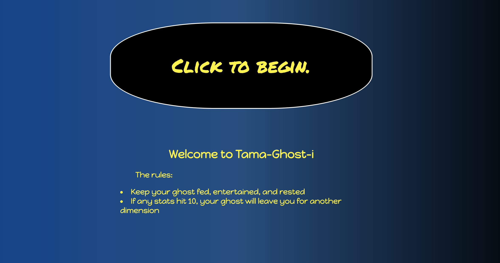
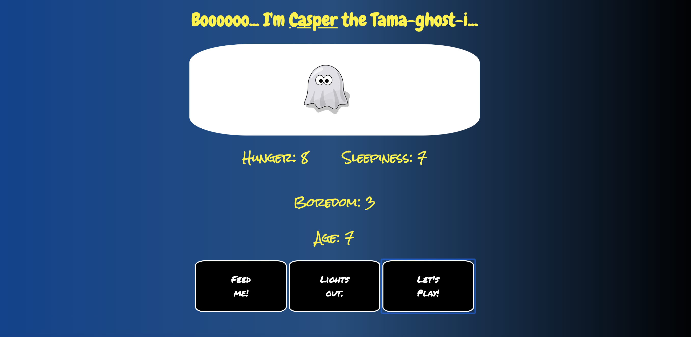

# Tama-Ghost-i

This game takes virtual pets to a whole new dimension while you care for your ghost.

Play it here: https://alexander215.github.io/TamaGhosti/

## How to Play:
- Click the start button and enter a name for your ghost
- As time passes, the three stats (hunger, sleepiness, and boredom) will increase
- You can decrease the stats by pressing the appropriate button
- Each state will increase at different rate, and decrease by different increments
- How to win: Beat your high score of the age your ghost reaches
- How to lose: Allow any of the stats to reach 10

## Technology Used:
- HTML
- CSS
- JavaScript

## Author
This project was built by Alexander Hoskinson

